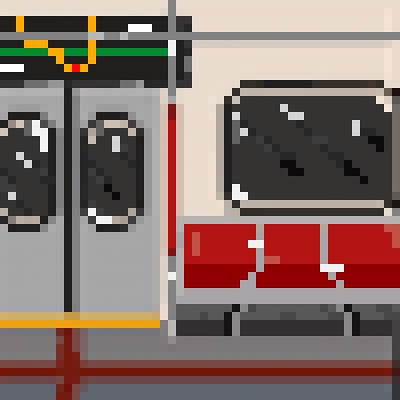

# ridethesubway

Everyone sure misses commuting! **ridethesubway** is a fun, quick project that creates an artificial subway ride ambience. 

  

### Technology

Made with HTML, CSS, React, MUI (React UI library).

Designed in Figma. Pixel Art drawn in Procreate/Dottable.

### Credits

Inspired by [soundsofhome](www.soundsofhome.ca)

Announcer Audio: https://www.youtube.com/watch?v=r1_Ep-vp24I

Subway Audio: https://www.youtube.com/watch?v=CsvqBYrlNF4

Music: Travis Scott - sdp interlude extended (to be changed)

Chatter Audio: To Be Added

